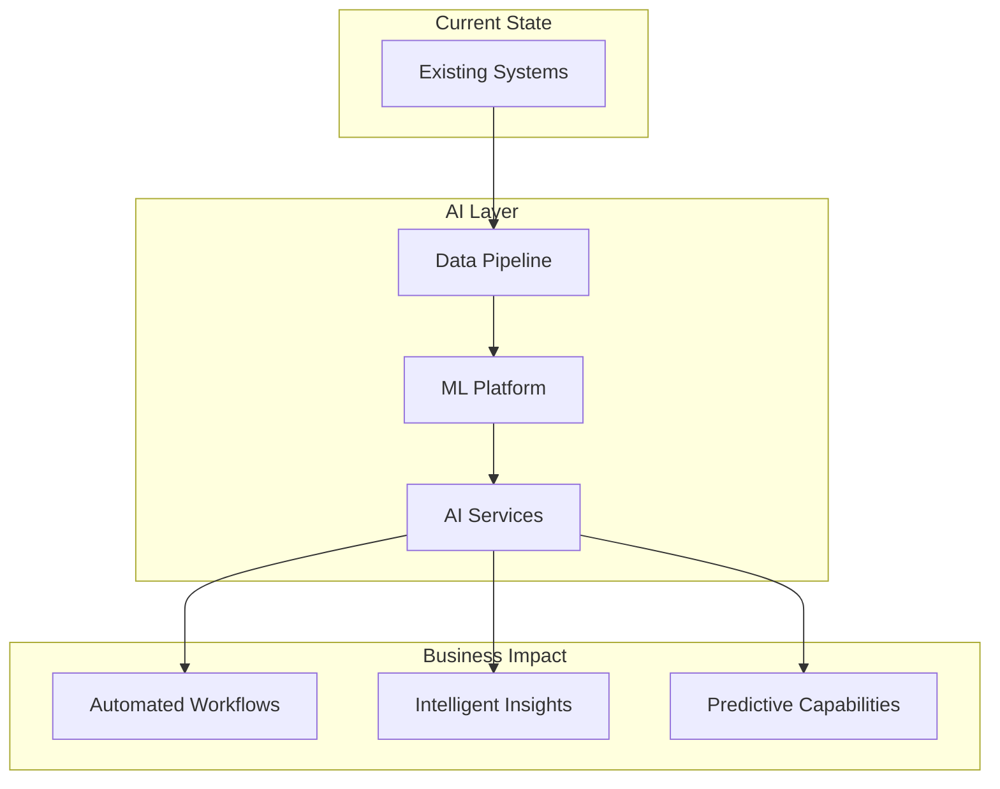
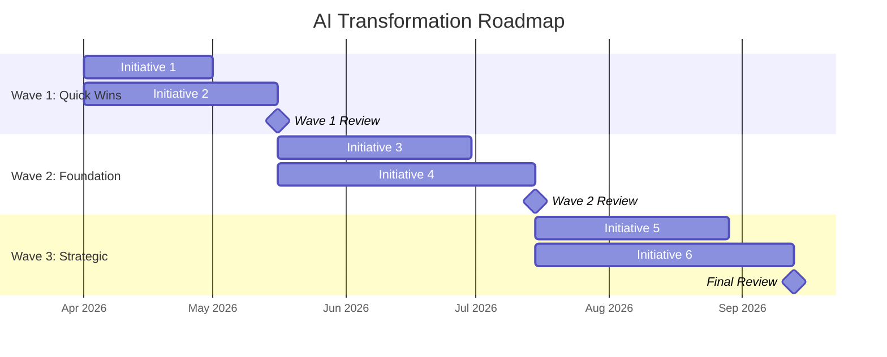

# Consulting Pitch & Proposal Generator

Generate polished consulting proposals, executive summaries, or pitch deck outlines from client discovery and opportunity data. Three output formats available, each tailored to a different audience and decision stage.

## Prerequisites

This skill requires completed discovery and opportunity mapping. Check for files at:
```
clients/<client-name>/profile.md
clients/<client-name>/discovery/current-state.md
clients/<client-name>/discovery/maturity-assessment.md
clients/<client-name>/assessment/opportunity-matrix.md
clients/<client-name>/assessment/roadmap.md
```

If discovery files are missing, redirect:
```
Discovery data not found for <client-name>. Run /client-discovery <client-name> first.
```

If opportunity mapping files are missing, redirect:
```
Opportunity data not found for <client-name>. Run /opportunity-map <client-name> first.
```

## Step 1 — Load Client Data

1. Read all files in `clients/<client-name>/`
2. Extract key data points:
   - Company name, industry, size, revenue range
   - Pain points and goals
   - AI maturity score and readiness level
   - Top-ranked initiatives from opportunity matrix
   - Three-wave roadmap
   - ROI data (if available from /roi-calculator)
   - Department recommendations

## Step 2 — Determine Format

Parse the `--format` flag. Default to `proposal` if not specified.

| Format | Audience | Length | Purpose |
|---|---|---|---|
| `proposal` | Decision-makers + technical leads | 5-8 pages | Full engagement proposal for budget approval |
| `exec-summary` | C-suite / board | 1 page | Quick decision document for executive review |
| `deck-outline` | Presentation audience | 9 slides | Slide-by-slide outline for live pitch |

## Step 3 — Generate Document

### Format: `proposal` (Full Proposal — 5-8 pages)

Generate a complete consulting proposal with the following sections:

#### Section 1: Cover Page

```
═══════════════════════════════════════════════════════
          AI TRANSFORMATION PROPOSAL

          Prepared for: [Company Name]
          Prepared by: [Your Firm / Your Name]
          Date: [Current Date]

          CONFIDENTIAL
═══════════════════════════════════════════════════════
```

#### Section 2: Executive Summary (<400 words)

Write a compelling executive summary that covers:
- The client's current situation and key challenges (2-3 sentences)
- The opportunity AI presents for their specific business (2-3 sentences)
- The recommended approach at a high level (2-3 sentences)
- Expected outcomes and ROI headline number (2-3 sentences)
- Call to action (1 sentence)

This section must be under 400 words. It should stand alone — a reader who only reads this section should understand the full value proposition.

#### Section 3: Current State Assessment

Summarize from discovery data:
- Business context and market position
- Technology landscape (include Mermaid architecture diagram from current-state.md)
- AI maturity scorecard (reproduce the ASCII visualization)
- Key gaps and risks of inaction

#### Section 4: Opportunities Identified

Present the top opportunities:
- Include the 2x2 priority matrix (ASCII) from opportunity-matrix.md
- Highlight the top 3-5 initiatives by weighted score
- For each highlighted initiative: name, description, expected impact, feasibility assessment
- Connect each opportunity to a specific pain point the client raised

#### Section 5: Recommended Approach

Detail the phased engagement:
- Overview of the three-wave approach
- Why phased delivery reduces risk and builds confidence
- Governance model (steering committee, sprint reviews, success metrics)
- Our methodology (discovery, pilot, scale framework)

#### Section 6: Solution Architecture

Generate a Mermaid diagram showing the proposed AI-enabled architecture:



Customize based on actual recommended initiatives and existing tech stack.

#### Section 7: Implementation Roadmap

Generate a Mermaid Gantt chart showing the three-wave roadmap:



Adjust dates, initiative names, and durations based on the actual roadmap.

#### Section 8: Investment & ROI

Present a clear investment table:

```
Investment Summary
══════════════════════════════════════════════════════════════════
                        Wave 1      Wave 2      Wave 3      Total
──────────────────────────────────────────────────────────────────
Implementation          $XX,XXX     $XX,XXX     $XX,XXX     $XXX,XXX
Infrastructure          $X,XXX      $XX,XXX     $XX,XXX     $XX,XXX
Training & Change Mgmt  $X,XXX      $X,XXX      $X,XXX      $XX,XXX
──────────────────────────────────────────────────────────────────
Total Investment        $XX,XXX     $XX,XXX     $XX,XXX     $XXX,XXX
══════════════════════════════════════════════════════════════════

Expected Annual Return: $XXX,XXX - $X,XXX,XXX
Payback Period: X-X months
3-Year ROI: XXX% - XXX%
```

Include the "cost of doing nothing" — estimate what the client loses each month/year by not adopting AI:
- Continued manual costs
- Competitive disadvantage
- Missed revenue opportunities
- Talent attrition risk

If ROI calculator data is available (from /roi-calculator), use those numbers. Otherwise, provide conservative estimate ranges based on industry benchmarks.

#### Section 9: Team & Engagement Model

Describe the proposed team structure:
- Engagement lead (role and responsibilities)
- Technical architect (role and responsibilities)
- ML/AI engineers (role and responsibilities)
- Client-side team requirements (who needs to be involved)
- Communication cadence (weekly standups, bi-weekly demos, monthly steering)

#### Section 10: Next Steps

Clear call to action:
1. Schedule a 60-minute deep-dive session to review this proposal
2. Identify internal champions and steering committee members
3. Sign engagement letter and SOW for Wave 1
4. Kick off discovery sprint (Week 1)

Include contact information placeholder and proposed start date.

---

### Format: `exec-summary` (1-Page Executive Summary)

Generate a single-page executive summary with these sections, each kept extremely concise:

```
═══════════════════════════════════════════════════════
  AI OPPORTUNITY BRIEF — [Company Name]
  [Date] | Confidential
═══════════════════════════════════════════════════════

THE PROBLEM
[2-3 sentences: What pain points are costing the client money/time/market share]

THE OPPORTUNITY
[2-3 sentences: What AI can do for this specific business, with one quantified claim]

OUR APPROACH
[3-4 bullet points: Phased delivery, key initiatives, timeline]

EXPECTED ROI
[Key metrics: annual savings, revenue impact, payback period — in a mini-table]

INVESTMENT
[Total range and per-wave breakdown in one line each]

TIMELINE
[One-line summary: "6-month engagement across 3 waves, first results in 60 days"]

NEXT STEP
[One sentence CTA: "Schedule a 60-minute deep-dive to review the full proposal."]

═══════════════════════════════════════════════════════
```

Total length must fit on one printed page (~500 words max).

---

### Format: `deck-outline` (9-Slide Pitch Deck Outline)

Generate a slide-by-slide outline with speaker notes. The deck must map Arth AI's **actual agent ecosystem** to the client's needs — not generic consulting language. Reference specific agents and skills by name.

#### Slide 1: Title
- "Arth AI x [Client Name]"
- Subtitle that captures the engagement thesis (not generic "AI Transformation")
- Date and confidentiality notice
- Speaker notes: Opening hook — reference a specific pain point from discovery

#### Slide 2: Strategic Context
- Reframe the client's stated vision into 2-3 strategic dimensions (synthesize, don't parrot)
- Show the interdependencies between their goals
- Highlight the key insight: what must happen first before the rest works
- Speaker notes: Demonstrate that we've analyzed their strategy, not just read it

#### Slide 3: The Arth AI Agent Ecosystem
- High-level overview of what Arth AI brings: 20 agents + 30 skills, organized by capability category
- Present as a capability map with 6 categories:

| Category | Agents | What They Do |
|---|---|---|
| Software Engineering | `architect`, `code-reviewer`, `frontend`, `python-backend` | Design, build, review, ship |
| Quality Assurance | `qa` + 5 specialized QA agents | Test strategy, generation, quality gates |
| Product & Design | `product-manager`, `design-studio` (3 agents) | Ideate, design, critique, plan |
| Infrastructure & Ops | `sre`, `ops` | Deploy, monitor, incident response |
| GTM & Sales | `gtm-expert` | Position, enable, compete |
| Strategy & Consulting | `ai-consultant` | Discover, assess, propose, track |

- Speaker notes: "This isn't a slide deck about AI. These are production agents your team works with daily — they design your systems, review your code, build your products, and run your infrastructure."

#### Slide 4: Department × Agent Mapping
- **This is the differentiator slide.** Map specific agents and skills to each of the client's departments.
- Table format:

| Department | Their Ask | Arth AI Agents & Skills | Example Use |
|---|---|---|---|
| [Dept 1] | [From discovery] | `agent1`, `agent2`, `/skill1` | [One concrete scenario] |
| [Dept 2] | [From discovery] | `agent3`, `/skill2`, `/skill3` | [One concrete scenario] |

- Include one "in practice" example per department showing an agent workflow
- Speaker notes: Walk through each row — "For [department], your team uses the [agent] to [specific action]. Here's what that looks like: [scenario]."

#### Slide 5: Phase 1 — Deploy & Discover (Weeks 1-4)
- Focus: Deploy quick-win agents + run consulting discovery
- Table: What We Deploy | What Your Team Gets | Departments
- Must reference specific agents being deployed (e.g., "Deploy `code-reviewer` and `qa` agents to Engineering")
- Include the consulting discovery deliverables (`/client-discovery` outputs)
- Speaker notes: "By week 4, your engineering team is shipping with AI code review, your QA has automated test generation, and we have a full current-state assessment to drive Phase 2."

#### Slide 6: Phase 2 — Build & Innovate (Weeks 5-10)
- Focus: Use agents to BUILD new AI features and products
- This is where `product-manager`, `design-studio`, `architect`, `frontend`, `python-backend` agents come in
- Show the product development workflow: `product-manager` → `design-studio-think` → `design-studio-create` → `architect` → `frontend`/`python-backend` → `code-reviewer` → `qa`
- The client's team works alongside these agents to ideate, design, and build their AI product features
- Include `/planning` and `/implement` skills
- Speaker notes: "Phase 2 is where your product vision becomes real. Your product leads use the `product-manager` agent to scope features, `design-studio` to iterate on UX, and our engineering agents to build and ship. Your team learns the methodology by working inside it."

#### Slide 7: Phase 3 — GTM & Scale (Weeks 11-16)
- Focus: Package capabilities into sellable services + methodology transfer
- Deploy `gtm-expert` for market positioning and sales enablement
- Use `/deliverable-builder` for case studies, board decks, training plans
- Use `/market-research` for competitive positioning
- Methodology transfer: the client's team inherits the agent ecosystem and consulting playbooks
- Speaker notes: "Phase 3 converts everything you've built into revenue. The `gtm-expert` agent positions your AI services, builds your sales collateral, and analyzes your competitive landscape."

#### Slide 8: What We Need to Explore Together
- Discovery inputs required to move from proposal to SOW
- Table: Category | What We Need | Why It Matters
- Speaker notes: "These are the inputs that transform this directional strategy into a costed execution plan."

#### Slide 9: Next Steps
- 3 clear action items with owners
- Commitment statement: "Build capability, not dependency"
- Contact information
- Speaker notes: End with the autonomy pitch — "Our success is measured by how quickly you don't need us."

## Step 4 — Quality Gate

Before outputting the final document, run these quality checks:

1. **Fact Check**: Every claim, metric, and data point must trace back to client-provided materials, a cited industry benchmark, or a verified source. If a number cannot be sourced, remove it or mark it `[TO BE VALIDATED]`. Never fabricate statistics, dollar figures, percentages, or timelines.
2. **Consistency Check**: All numbers, dates, and initiative names match across sections
3. **Pain Point Coverage**: Every client pain point from discovery is addressed at least once
4. **Specificity Check**: No generic placeholder language remains — all content is customized to the client
5. **Length Check**: Proposal is 5-8 pages, exec-summary is under 500 words, deck-outline has exactly 9 slides
6. **CTA Check**: Clear next steps with specific actions are included
7. **Tone Check**: Professional consultant language — measured, authoritative, non-committal on unvalidated specifics. Use qualifying language for unconfirmed items ("initial assessment indicates," "subject to validation," "pending discovery"). Never salesy or overpromising.
8. **Data Check**: All ROI figures are reasonable, defensible, and sourced. If ROI data is not available, state the opportunity qualitatively and note that quantification requires a discovery deep-dive with client data.
9. **Source Attribution**: Client-provided information must be attributed ("Per your AI-First Strategy presentation," "As outlined in your roadmap"). This builds trust and demonstrates grounding in the client's reality.
10. **Open Questions**: Unknown items must be framed as collaborative discovery questions, not filled with assumptions. Include a clear "What we need to explore together" section.

If any check fails, fix the issue before outputting.

## Step 5 — Output Files

Save the generated document(s) in `clients/<client-name>/proposals/`:

| Format | Output File |
|---|---|
| `proposal` | `proposals/full-proposal.md` |
| `exec-summary` | `proposals/executive-summary.md` |
| `deck-outline` | `proposals/deck-outline.md` |

If the `proposals/` directory doesn't exist, create it.

After saving, inform the user:
```
Proposal generated: clients/<client-name>/proposals/[filename].md

To generate other formats, run:
  /pitch-generator <client-name> --format exec-summary
  /pitch-generator <client-name> --format deck-outline
```

## Notes

- Never use generic consulting language — every sentence must reference the client's specific situation
- ROI projections should be conservative — use ranges rather than point estimates
- If ROI calculator has been run, use those numbers; otherwise, use industry benchmark ranges
- Mermaid diagrams must be syntactically valid and renderable
- The proposal should read as if written by a senior consultant, not generated by AI
- Include "[Your Firm Name]" as a placeholder where the consulting firm name should go
- Flag any sections where data is insufficient with "[DATA NEEDED: description]" markers

## Cost

~8-12 units per invocation.

**Spawn ladder:** 0-1 Haiku (optional, only if client data contradictory or sparse).
**Inline:** Template population, TOC generation, table formatting (deterministic).
**KB reads:** clients/{name}/profile.md, discovery/*, assessment/*.

Tier weights: Haiku=1, Sonnet=7, Opus=50.
